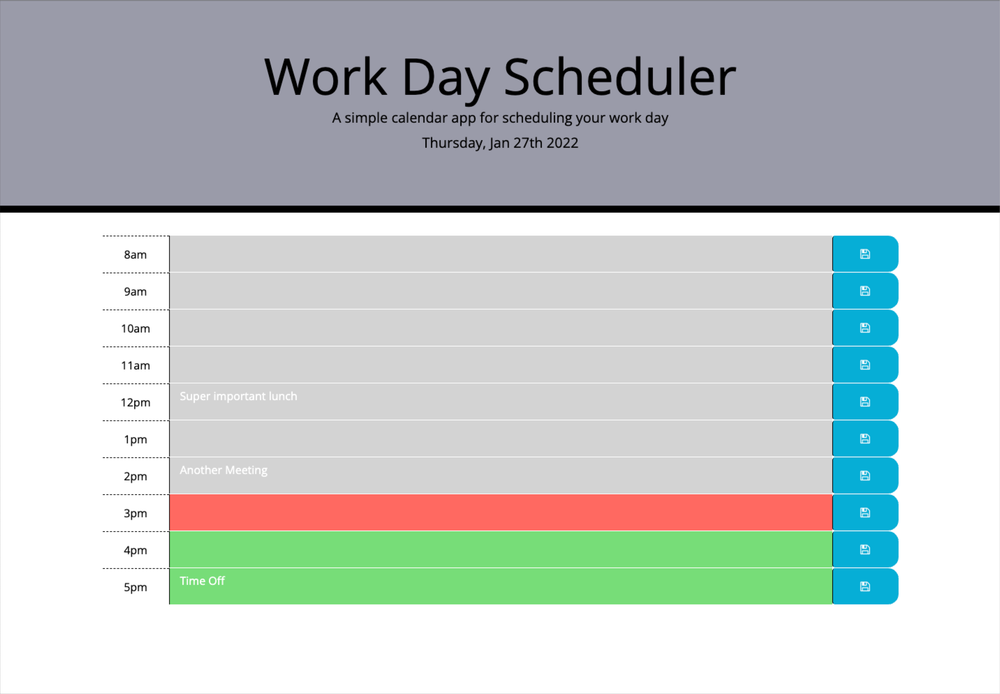
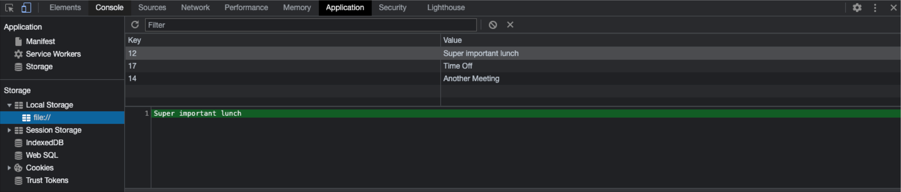

## Homework #5 Third-Party APIs: Work Day Scheduler

Build a daily planner that allows the user to input tasks into the schedule and save entries
Functionality includes:
* Insert current time and date using moment.js
* Display hour blocks from 8am - 5pm
* Past hours are in grey
* Future hours are green
* Current hour is red
* When a user enters text, store time and description in local storage
* Persist data so if the user refreshes or brings up the page again, items in local storage are displayed

